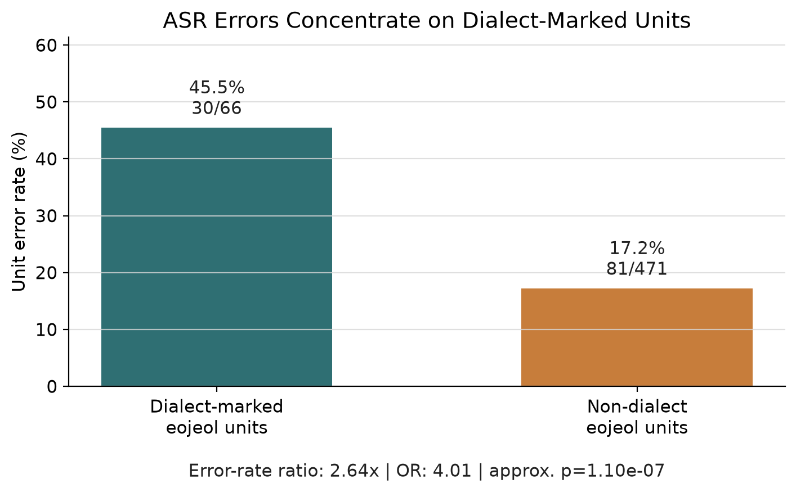
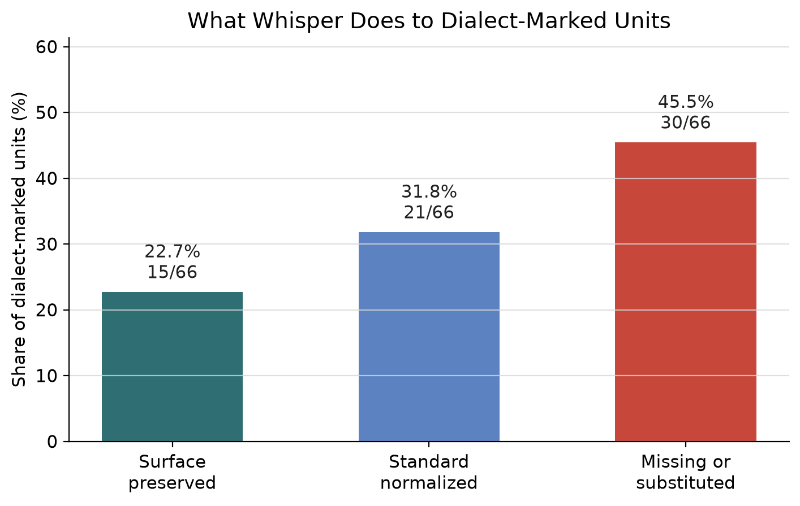
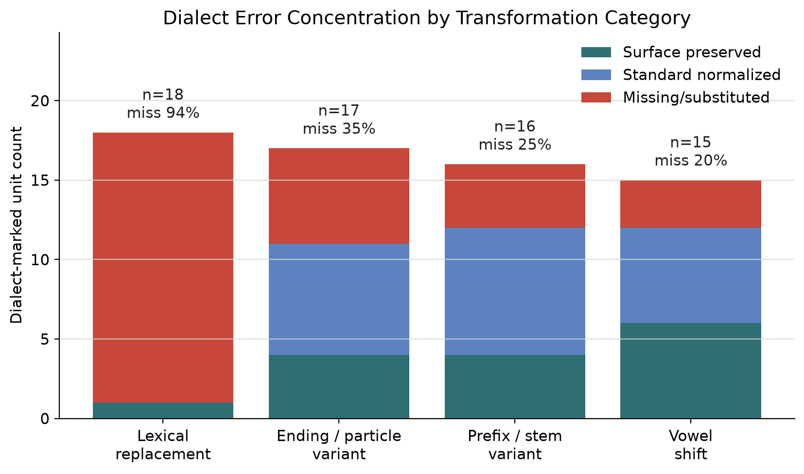
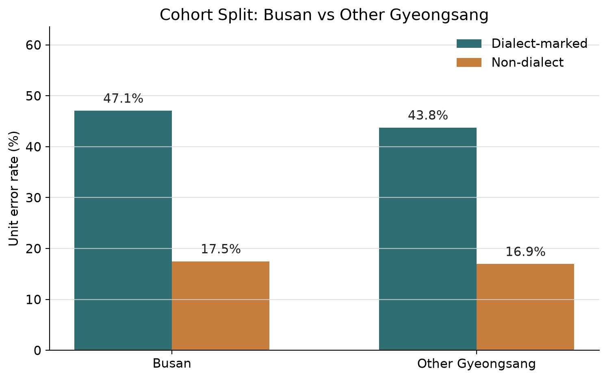

# Faster-Whisper Medium Dialect Attribution Pilot

## 결론

현재 pilot 기준 결론은 명확하다. `faster-whisper:medium`은 같은 50개 utterance 안에서도 방언 표지 어절을 일반 어절보다 훨씬 더 자주 놓치거나 대체한다.

따라서 “경상/부산 방언이 실제로 ASR에서 더 문제가 되는가?”라는 사전 문제정의는 통과로 본다. 다만 아직 50개 pilot이고 speaker-independent gold split이 아니므로, 논문 본문에서는 최종 claim이 아니라 problem-definition evidence로 써야 한다.

추가 text-only 감사 결과, 자동 evaluator의 `missing_or_substituted` 30개 중 잠재적 의미 손상 후보는 9개로 좁혀졌다. 즉 방언 표면 오류는 강하지만, 그 전부를 AICC 유해 오류로 취급하면 안 된다.

## 핵심 결과

| Measure | Value |
|---|---:|
| 평가 utterance | 50 |
| 방언 표지 어절 단위 | 66 |
| 비방언 어절 단위 | 471 |
| 방언 표지 어절 오류율 | 45.5% |
| 비방언 어절 오류율 | 17.2% |
| 오류율 비율 | 2.64x |
| Odds ratio | 4.01 |
| Odds ratio 95% CI | 2.34-6.89 |
| 2-proportion 근사 p-value | 1.10e-07 |

해석: 이 정도 차이는 단순한 ASR 랜덤 노이즈로 보기 어렵다. 범용 Whisper-family baseline이 방언 표지 단위에서 뚜렷하게 취약하다는 초기 근거가 생겼다.

## Whisper가 방언을 어떻게 처리하는가

66개 방언 표지 어절 중 결과는 다음과 같다.

| Outcome | Count | Share |
|---|---:|---:|
| 방언 표면 보존 | 15 | 22.7% |
| 표준어 정규화 | 21 | 31.8% |
| 누락 또는 대체 | 30 | 45.5% |

중요한 점은 방언 표지 어절이 전부 “틀린다”가 아니라는 것이다. 약 31.8%는 표준어로 정규화된다. AICC 관점에서는 이런 경우가 의미 보존이면 치명적 오류가 아닐 수 있다. 그래서 논문에서는 WER/CER만 쓰면 부족하고, 아래 세 가지를 분리해야 한다.

- 의미 손상 가능성이 큰 ASR 누락/대체
- 의미 보존 가능성이 있는 표준어 정규화
- 방언 표면 보존

## 오류가 집중되는 지점

가장 강한 신호는 lexical replacement다. lexical replacement 방언 단위 18개 중 17개가 누락 또는 대체로 잡혔다. 반면 ending/particle, prefix/stem, vowel shift는 Whisper가 표준어로 정규화하는 경우가 더 많다.

다음 단계의 작업 가설은 이렇게 잡는 것이 좋다.

> 경상도 방언의 모든 음운 변화가 동일하게 치명적인 것이 아니라, lexical dialect replacement가 AICC semantic failure로 이어질 가능성이 가장 큰 1차 위험군이다.

## 부산 vs 기타 경상

Busan과 non-Busan Gyeongsang은 pilot에서 비슷한 패턴을 보인다.

| Cohort | Dialect unit error | Plain unit error |
|---|---:|---:|
| Busan | 47.1% | 17.5% |
| Other Gyeongsang | 43.8% | 16.9% |

현재 해석: 이 pilot은 “경상도 방언 ASR 문제”는 지지하지만, “부산만 유독 어렵다”는 주장은 아직 지지하지 않는다. 부산 특화 novelty를 주장하려면 더 큰 speaker-balanced slice에서 Busan vs other Gyeongsang 차이를 다시 봐야 한다.

## 연구적 판단

진행해도 된다. 단, 논문 framing은 조심해야 한다.

현재 말할 수 있는 claim:

> AI-Hub 경상도 50개 utterance pilot에서 `faster-whisper:medium`은 방언 표지 어절에 대해 비방언 어절보다 2.64배 높은 unit error rate를 보였고, 오류는 lexical replacement 형태에 가장 강하게 집중되었다.

아직 말하면 안 되는 claim:

- 부산 방언이 기타 경상 방언보다 유의하게 더 어렵다.
- 이 결과가 곧바로 AICC TA 실패를 증명한다.
- Whisper가 한국어 특화 ASR보다 나쁘다.
- fine-tuning이나 adapter가 문제를 해결한다.

## 다음 필수 작업

1. `dialect_asr_text_audit.local.jsonl`의 9개 potentially harmful 후보와 7개 low-impact 후보를 human/audio review한다.
2. pilot semantic annotation을 human review 후 freeze해서 AICC-critical impact를 측정한다.
3. 가능하면 `large-v3` 또는 `large-v3-turbo`로 Whisper-family strong baseline을 추가한다.
4. Whisper-only paper가 되지 않도록 Korean ASR baseline을 하나 추가한다.
5. 50개 pilot에서 speaker-independent validation split으로 확장한다.

## 산출물

- ASR hypotheses: `faster_whisper_medium.local.jsonl`
- Error analysis summary: `dialect_asr_error_analysis_summary.json`
- Local row-level error cases: `dialect_asr_error_cases.local.jsonl`
- Text audit report: `text_audit_report.md`
- Text audit summary: `dialect_asr_text_audit_summary.json`
- Shareable no-transcript row manifest: `dialect_asr_error_manifest.jsonl`
- Figures: `figures/`
